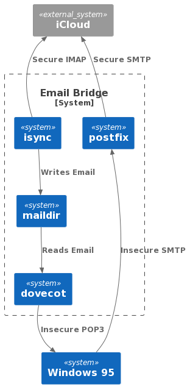
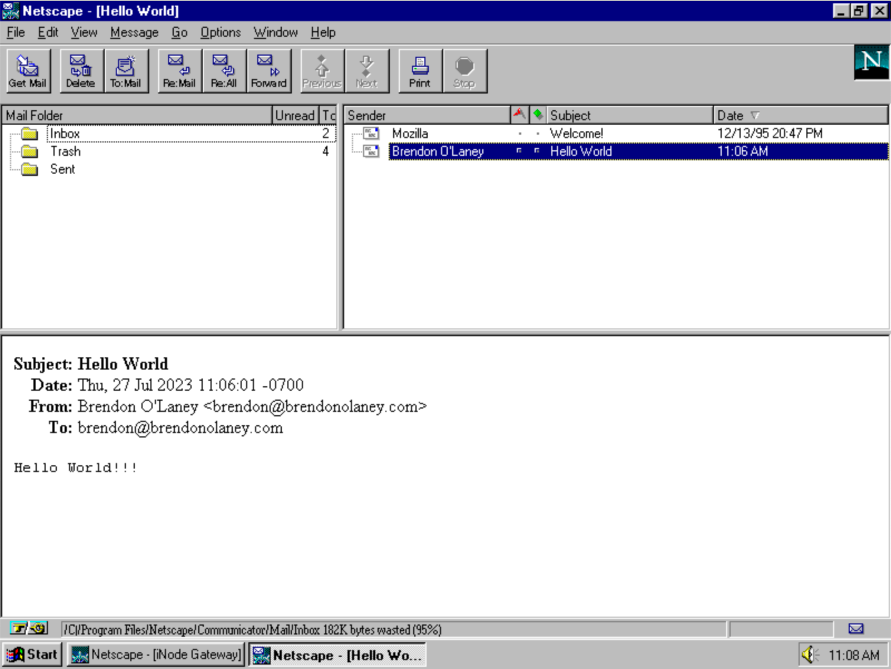

::: {.blog}

I recently discovered a project called [Protoweb][protoweb] which is an attempt
to recreate the web as it existed in 1995. This was the time for me when I first
got access to the internet over a blisteringly fast 33.6Kbaud modem so, of
course, I needed to give it a try. However, it wasn’t enough for me to just
browse on my shiny new computer with its anachronistically fast processor, no. I
had to boot my favourite [x86 PC emulator][86box], install a copy of Windows 95
and experience things as they were in 1995, less the headache inducing CRT
monitor.

Windows 95 is amazingly usable. I had quickly put it through its paces doing
some basic tasks. I had quickly managed to listen to my copy of Big Shiny Tunes
2 in a period accurate version of Winamp, draft some prose in Word 95, generate
a graph in Excel, make a basic presentation in PowerPoint, and even compile some
console and GUI applications in Visual C++. Something was missing, however.
Browsing the *modern* internet using Netscape Navigator 2 is strictly off the
table since it doesn’t support modern cryptography. There are some
[workarounds][frogfind] for the browsing issue, and of course
[Protoweb][protoweb] is *amazing*, but I wasn’t able to find a good way to send
or receive email.

Netscape Communicator only supports insecure [POP3][pop3] and [SMTP][smtp] and,
so far as I can tell, there are no current email providers that allow for this
configuration (with good reason). But, certainly, I should be able to send and
receive email insecurely from a computer on my local network that has all the
modern cryptography necessary to forward that email securely to my normal
provider right?



All that I need to do to make this system (relatively) secure is configure the
bridge to only accept incoming connections from the local network;
192.168.0.0/16 in my case. Alpine Linux is my usual go to for containers/virtual
machines these days. In this case I decided to use a virtual machine because I
find them easier to mess around with when prototyping and idea. After installing
the base system I just need to install a few packages:

```bash
apk add dovecot dovecot-pop3d isync postfix
```

Configure the dovecot server: `/etc/dovecot/dovecot.conf`

```
protocols = pop3
mail_location = maildir:/mail
mail_privileged_group = mail
auth_mechanisms = plain
disable_plaintext_auth = no
ssl = no
pop3_client_workarounds = oe-ns-eoh outlook-no-nuls
pop3_deleted_flag = popped
pop3_delete_type = flag
pop3_fast_size_lookups = no
pop3_uidl_format = %08Xu%08Xv
log_path = /var/log/dovecot.log

passdb {
driver = passwd-file
args = scheme=PLAIN /etc/mailpasswd
}

userdb {
driver = passwd-file
args = /etc/mailpasswd
}

namespace inbox {
inbox = yes
separator = /
}
```

Note here that the dovecot server will source its authentication from a file at
`/etc/mailpasswd`. I like to make the username and password the same as the one
I use to log in to the Alpine Linux VM because that’s how postfix authenticates.
Doing it this way makes for a more consistent experience.

The dovecot authentication file `/etc/mailpasswd`:

```
<YOUR USERNAME>:{PLAIN}<YOUR PASSWORD>:1000:1000::/home/<YOUR USERNAME>::userdb_mail=maildir:/home/<YOUR USERNAME>/mail/ allow_nets=192.168.0.0/16,local,127.0.0.1/32
```

With dovecot in place and configured, now you need to get your email into the
maildir. For some reason the executable for the isync package is called mbsync.
This is a pretty simple configuration that only syncs the last 100 messages in
the inbox from your account. I created a file at `~/.mbsyncrc`:

```
IMAPAccount brendonolaney
Host <YOUR IMAP SERVER>
Port <YOUR IMAP PORT>
UserCmd "cat ~/.netrc | grep 'machine <YOUR IMAP SERVER>' | awk 'FNR=1 {print $4}'"
PassCmd "cat ~/.netrc | grep 'machine <YOUR IMAP SERVER' | awk 'FNR=1 {print $6}'"
SSLType IMAPS
SSLVersions TLSv1.3

IMAPStore remote
Account <YOUR ACCOUNT NAME>

MaildirStore local
Path /home/<YOUR LOCAL USER NAME>/mail
Inbox /home/<YOUR LOCAL USER NAME>/mail

Channel inbox
Far :remote:
Near :local:
MaxMessages 100
Create Near
SyncState *

Group <YOUR ACCOUNT NAME>
Channel inbox
```

For the `UserCmd` and `PassCmd` entries in the above configuration I created a
`~/.netrc`:

```
machine <YOUR EMAIL IMAP ADDRESS> user <YOUR EMAIL IMAP USERNAME> pass <YOUR EMAIL PASSWORD>
machine <YOUR EMAIL SMTP ADDRESS> user <YOUR EMAIL SMTP USERNAME> pass <YOUR EMAIL PASSWORD>
```

It’s best practice to make this file only readable by your user account: `chmod
0600 ~/.netrc`.

Next we need to configure the postfix server with `/etc/postfix/main.cf`:

```
compatibility_level = 3.8
queue_directory = /var/spoll/postfix
command_directory = /usr/sbin
daemon_directory = /usr/libexec/postfix
data_directory = /var/lib/postfix
mail_owner = postfix
unknown_local_recipient_reject_code = 550
debug_peer_level = 2
debugger_command =
  PATH=/bin:/usr/bin:/usr/local/bin:/usr/X11R6/bin
  ddd $daemon_directory/$process_name $process_id & sleep 5
sendmail_path = /usr/sbin/sendmail
newaliases_path = /usr/bin/newaliases
mailq_path = /usr/bin/mailq
setgid_group = postdrop
html_directory = no
manpage_directory = /usr/share/man
sample_directory = /etc/postfix
readme_directory = /usr/share/doc/postfix/readme
inet_protocols = ipv4
meta_directory = /etc/postfix
shlib_directory = /usr/lib/postfix

smtp_sasl_auth_enable = yes
smtp_tls_security_level = encrypt
smtp_sasl_security_options = noanonymous
mynetworks = 192.168.0.0/16
smtp_password_maps = static:<YOUR EMAIL USERNAME>:<YOUR EMAIL PASSWORD>
relayhost = <YOUR SMTP SERVER>:<YOUR SMTP PORT>
```

One last thing we need to do is configure isync to periodically fetch new
messages from your email server by updating your cron file at
`/etc/crontabs/<YOUR USERNAME>`:

```
*/1    *    *    *    *    mbsync -c ~/.mbsyncrc -a
```

Finally, all we need to do is add the dovecot and postfix services to Alpine’s
launch daemons, and restart everything:

```
rc-update add dovecot
rc-update add postfix
rc-service dovecot restart
rc-service crond restart
rc-service postfix restart
```

Now all you should need to do is configure Netscape Communicator with your
bridge’s IP address (run `ifconfig` on the bridge to get this), and the same
username and password you use to log in to the bridge.



Happy mailing!

:::

[protoweb]: https://protoweb.org
[86box]: https://86box.net
[frogfind]: http://frogfind.com
[pop3]: https://en.wikipedia.org/wiki/Post_Office_Protocol
[smtp]: https://en.wikipedia.org/wiki/Simple_Mail_Transfer_Protocol
