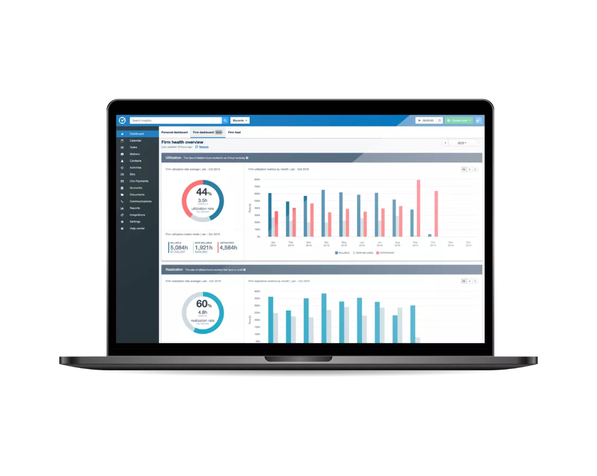

The firm dashboard is a metrics calculation, storage, and visualization system
that I implemented for Clio. It is an on-demand system that gathers data,
transforms it, and reduces it into a set of metrics for rendering in a graph. I
built it with modularity in mind so that new infrastructure may be added and
used as a new data source or data store in the future.

The major technical hurdle for this project was calculating the values with
minimal impact on the availability of the database and the performance of job
runners in order to play nice with the other processes being managed by the job
runner. To facilitate this I developed a job runner that allows us to control
how jobs are processed in both parallel and in serial to allow us to strike the
correct balance between the number of jobs running simultaneously and the length
of each job on the system.
